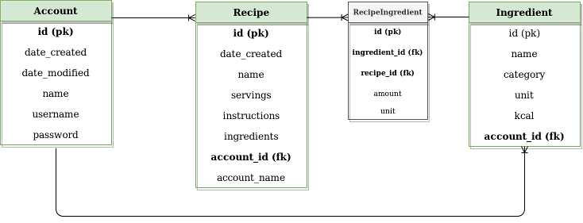

### Database diagram and table creation statements
---



```sql
CREATE TABLE account (
	id INTEGER NOT NULL, 
	date_created DATETIME, 
	date_modified DATETIME, 
	name VARCHAR(144) NOT NULL, 
	username VARCHAR(144) NOT NULL, 
	password VARCHAR(144) NOT NULL, 
	PRIMARY KEY (id), 
	UNIQUE (username)
);
```

```sql
CREATE TABLE ingredient (
	id INTEGER NOT NULL, 
	name VARCHAR(144) NOT NULL, 
	category VARCHAR(100), 
	unit VARCHAR(20), 
	kcal FLOAT, 
	account_id INTEGER NOT NULL, 
	PRIMARY KEY (id), 
	UNIQUE (name), 
	FOREIGN KEY(account_id) REFERENCES account (id)
);
```

```sql
CREATE TABLE recipe (
	id INTEGER NOT NULL, 
	date_created DATETIME, 
	name VARCHAR(144) NOT NULL, 
	instructions TEXT, 
	time INTEGER, 
	servings INTEGER, 
	account_id INTEGER NOT NULL, 
	account_name VARCHAR, 
	PRIMARY KEY (id), 
	FOREIGN KEY(account_id) REFERENCES account (id)
);
```

```sql
CREATE TABLE recipe_ingredient (
	id INTEGER NOT NULL, 
	recipe_id INTEGER, 
	ingredient_id INTEGER, 
	amount FLOAT, 
	unit VARCHAR, 
	PRIMARY KEY (id), 
	FOREIGN KEY(recipe_id) REFERENCES recipe (id), 
	FOREIGN KEY(ingredient_id) REFERENCES ingredient (id)
);
```